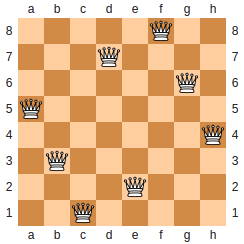

## N-queen problem

The **N queens puzzle** is the problem of placing N chess queens on an n×n chessboard so that no two queens threaten each other. Thus, a solution requires that no two queens share the same row, column, or diagonal. Solutions exist for all natural numbers n with the exception of n=2 and n=3.

*The only symmetrical solution to the eight queens puzzle (except for rotations and reflections of itself)*

### Backtracking Algorithm
The idea is to place queens one by one in different rows, starting from the first row. When we place a queen in a row, we check for clashes with already placed queens. In the current row, if we find a column for which there is no clash, we mark this row and column as part of the solution. If we do not find such a column due to clashes then we backtrack.

This algorithm of solving this problem is known as a 'depth-first search' or 'Backtracking' approach. This is much better than the naive approach where all possible arrangements of the queens need to produce and then check if it is a valid solution.

### More on this topic
- https://en.wikipedia.org/wiki/Eight_queens_puzzle
- http://www.geeksforgeeks.org/backtracking-set-3-n-queen-problem/
- https://developers.google.com/optimization/puzzles/queens
