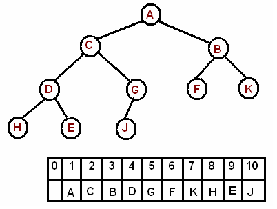

# Binary Heap

A **binary heap** is a complete binary tree which satisfies the heap ordering property. The ordering can be one of two types:

- *min-heap property:* the value of each node is greater than or equal to the value of its parent, with the minimum-value element at the root.
- *max-heap property:* the value of each node is less than or equal to the value of its parent, with the maximum-value element at the root.

A heap is a "complete tree" -- a complete tree is one in which there are no gaps between leaves. For instance, a tree with a root node that has only one child must have its child as the left node. More precisely, a complete tree is one that has every level filled in before adding a node to the next level, and one that has the nodes in a given level filled in from left to right, with no breaks.

In a heap the highest (or lowest) priority element is always stored at the root, hence the name "heap". A heap is not a sorted structure and can be regarded as partially ordered. As you see from the picture, there is no particular relationship among nodes on any given level, even among the siblings.

Since a heap is a complete binary tree, it has a smallest possible height - a heap with N nodes always has O(log N) height.

A heap is useful data structure when you need to remove the object with the highest (or lowest) priority. A common use of a heap is to implement a priority queue.

Here we will continue discussion with **Max Heap**.

**Min Heap** is same as **Max Heap** with just a simple comparison variation.

---
**Array Implementation**

A complete binary tree can be uniquely represented by storing its level order traversal in an array.

When we add elements to a heap, we fill it's tree-like structure from left to right, level by level. This makes heaps really easy to implement in an array, where the value for some index 's left child is located at index  and the value for its right child is at index  (using zero-indexing).

---
**Max Heap Construction:**

The new element is initially appended to the end of the heap (as the last element of the array). The heap property is repaired by comparing the added element with its parent and moving the added element up a level (swapping positions with the parent). This process is called "percolation up". The comparison is repeated until the parent is larger than or equal to the percolating element.

The worst-case runtime of the algorithm is O(log n), since we need at most one swap on each level of a heap on the path from the inserted node to the root.

**Max Heap Deletion:**

The maximum element can be found at the root, which is the first element of the array. We remove the root and replace it with the last element of the heap and then restore the heap property by percolating down.

Similar to insertion, the worst-case runtime is O(log n).

#### Complexity Analysis
- Insert - O(log n)
- Delete Max - O(log n)
- Find Max - O(1)
- Remove - O(log n)

### More on this topic
- https://en.wikipedia.org/wiki/Heap_(data_structure)
- https://www.cs.auckland.ac.nz/software/AlgAnim/heaps.html
- https://www.cs.cmu.edu/~adamchik/15-121/lectures/Binary%20Heaps/heaps.html
- http://www.cprogramming.com/tutorial/computersciencetheory/heap.html https://www.tutorialspoint.com/data_structures_algorithms/heap_data_structure.htm
